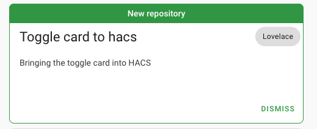

# ha-tdv-bar
A Home Assistant lovelace card to display bar chart  oriented to display power sensors

## Options

| Name              | Type    | Requirement  | Default             | Description                                 |
| ----------------- | ------- | ------------ | ------------------- | ------------------------------------------- |
| type              | string  | **Required** |                     | `custom:tdv-bar-card`
| title             | string  | **Optional** |                     | Optional header title for the card
| height            | number  | **Optional** | 200                 | The height of the card in pixels
| rangemax          | number  | **Optional** | 2000                | Maximum bar scale range
| entities          | object  | **Required** |                     | Displayed entities. See [Entities](#Entities)

### Entities

| Name              | Type    | Requirement  | Default             | Description                                 |
| ----------------- | ------- | ------------ | ------------------- | ------------------------------------------- |
| entity            | string  | **Required** |                     | Entity id of the sensor
| icon              | string  | **Optional** |                     | Icon for this entity
| name              | string  | **Optional** |                     | Custom label for this entity
| state             | string  | **Optional** |                     | Change state entity id (e.g. switch)
