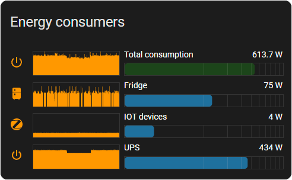
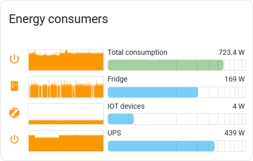
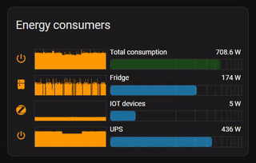

# ha-tdv-bar
A Home Assistant lovelace card to display bar chart  oriented to display power sensors

[](https://github.com/hacs/integration)

 


## Installation

### HACS

This card is available in HACS (Home Assistant Community Store).
HACS is a third party community store and is not included in Home Assistant out of the box.

### Alternative method

1. Download `ha-tdv-bar.js` from the [Releases](https://github.com/tdvtdv/ha-tdv-bar/releases) page
2. Upload to `/www/tdv-bar-card/ha-tdv-bar.js` (via Samba, File Editor, SSH, etc.)
3. Visit the Resources page in your Home Assistant install and add `/tdv-bar-card/ha-tdv-bar.js` as a
   JavaScript Module.
   [](https://my.home-assistant.io/redirect/lovelace_resources/)
4. Refresh your browser


## Options

| Name              | Type    | Requirement  | Default             | Description                                 |
| ----------------- | ------- | ------------ | ------------------- | ------------------------------------------- |
| type              | string  | **Required** |                     | `custom:tdv-bar-card`
| title             | string  | **Optional** |                     | Optional header title for the card
| height            | number  | **Optional** |                     | The height of the card in pixels
| rangemax          | number  | **Optional** | 2000                | Maximum bar scale range
| histmode          | number  | **Optional** | 1                   | Historical chart display mode<br>0-hide<br>1-show (this can be automatically overridden if the width of the widget is insufficient)
| animation         | number  | **Optional** | 1                   | Bar chart animation<br>0-disable<br>1-enable
| trackingmode      | number  | **Optional** | 1                   | Mouse tracking mode<br>0-disable<br>1-bar only<br>2-history<br>3-bar and history<br>4-all bars and history
| trackingvalue     | string  | **Optional** | max                 | Type of value to be tracked (min, avg, max)
| scaletype         | string  | **Optional** | log10               | Scale type (linear or log10 )
| colors            | object  | **Optional** |                     | Colors section See [Colors](#Colors)
| defaulticon       | string  | **Optional** | mdi:power           | Default icon for all unassigned entity icon
| entities          | object  | **Required** |                     | Displayed entities. See [Entities](#Entities)


### Colors

| Name              | Type    | Requirement  | Description                                 |
| ----------------- | ------- | ------------ | ------------------------------------------- |
| chart_bg          | string  | **Optional** | Chart background color
| chart             | string  | **Optional** | Chart color
| bar_bg            | string  | **Optional** | Bar background color
| bar               | string  | **Optional** | Bar color
| frame             | string  | **Optional** | Chart and bar frame color
| fontcolor         | string  | **Optional** | The color of the entity name and data

### Entities

| Name              | Type    | Requirement  | Description                                 |
| ----------------- | ------- | ------------ | ------------------------------------------- |
| entity            | string  | **Required** | Entity id of the sensor
| icon              | string  | **Optional** | Icon for this entity
| name              | string  | **Optional** | Custom label for this entity
| state             | string  | **Optional** | Change state entity id (e.g. switch)
| barcolor          | string  | **Optional** | Individual bar color





### Example

```yaml
type: custom:tdv-bar-card
title: Energy consumers
scaletype: log10
rangemax: 2500
histmode: 1
trackingmode: 4
trackingvalue: max
entities:
  - entity: sensor.energomonitor_power
    icon: mdi:power-standby
    name: Total consumption
    barcolor: '#008000'
  - entity: sensor.speaker_power
    icon: mdi:speaker
    name: Speaker
    state: switch.dinamiki_na_kukhne
  - entity: sensor.energomonitor_fridge_power
    icon: mdi:fridge
    name: Fridge
  - entity: sensor.iot_power
    icon: mdi:alert-octagram-outline
    name: IOT
    state: switch.iot
```